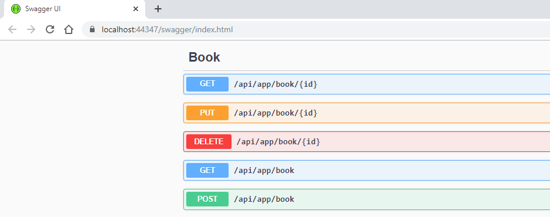

## Application Service

### BookDto

Create a `BookDto` class in `Bvh.BookStore..Application.Contracts` project

```csharp
public class BookDto : AuditedEntityDto<Guid>
{
    public string Name { get; set; }

    public BookType Type { get; set; }

    public DateTime PublishDate { get; set; }

    public float Price { get; set; }
}
```

Define mapping in `BookStoreApplicationMapperProfile` in `Bvh.BookStore.Application` project

```csharp
public class BookStoreApplicationAutoMapperProfile : Profile
{
    public BookStoreApplicationAutoMapperProfile()
    {
        CreateMap<Book, BookDto>();
    }
}
```

Add `CreateBookDto` class to `Bvh.BookStore..Application.Contracts` project

```csharp
public class CreateBookDto
{
    [Required]
    [StringLength(128)]
    public string Name { get; set; }

    [Required]
    public BookType Type { get; set; } = BookType.Undefined;

    [Required]
    public DateTime PublishDate { get; set; }

    [Required]
    public float Price { get; set; }
}
```

Add mapping in `BookStoreApplicationMapperProfile` in `Bvh.BookStore.Application` project

```csharp
CreateMap<CreateBookDto, Book>();
```

Add `UpdateBookDto` class to `Bvh.BookStore..Application.Contracts` project

```csharp
public class UpdateBookDto
{
    [Required]
    [StringLength(128)]
    public string Name { get; set; }

    [Required]
    public BookType Type { get; set; } = BookType.Undefined;

    [Required]
    public DateTime PublishDate { get; set; }

    [Required]
    public float Price { get; set; }
}
```

Add mapping in `BookStoreApplicationMapperProfile` in `Bvh.BookStore.Application` project

```csharp
CreateMap<UpdateBookDto, Book>();
```

Define an `IBookAppService` interface in `Bvh.BookStore..Application.Contracts` project

```csharp
public interface IBookAppService :
        ICrudAppService< //Defines CRUD methods
            BookDto, //Used to show books
            Guid, //Primary key of the book entity
            PagedAndSortedResultRequestDto, //Used for paging/sorting on getting a list of books
            CreateBookDto, //Used to create a new book
            UpdateBookDto> //Used to update a book
    {
    }
```

Add `BookAppService` class and implement an `IBookAppService` interface in `Bvh.BookStore..Application` project

```csharp
 public class BookAppService :
        CrudAppService<Book, BookDto, Guid, PagedAndSortedResultRequestDto, CreateBookDto, UpdateBookDto>,
        IBookAppService
    {
        public BookAppService(IRepository<Book, Guid> repository)
            : base(repository)
        {
        }
    }
```

Run the `Bvh.BookStore.HttpApi.Host` application and navigate to [https://localhost:XXXX/swagger/](https://localhost:XXXX/swagger/)
You will see some built-in service endpoints as well as the Book service and its REST-style endpoints



Swagger has a nice UI to test APIs. You can try to execute the [GET] /api/app/book API to get a list of books

[Home](./../../../README.md) | [Previous Step](StepByStep/../../Step3/Step3.md) | [Next Step](StepByStep/../../Step6/Step6.md)
